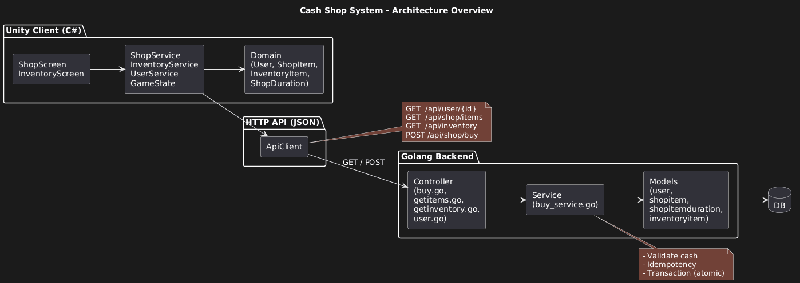
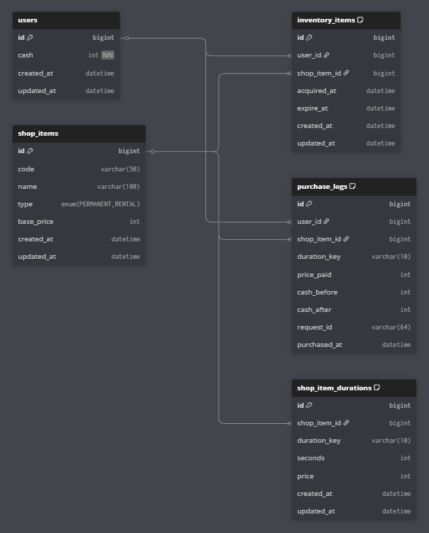

# Cash Shop & Inventory System

## Overview
This project demonstrates a Cash Shop system with rental items, server-side validation, and clean architecture separation between backend and Unity client.

---
## Tech Stack
- Backend: Golang, GORM, MySQL
- Client: Unity 2023.x (C#)

---
## System Architecture
- Backend follows layered architecture: handler → service → repository
- Unity client separates UI / Application / Domain / Infrastructure
- Server is the source of truth for all transactions

## Architecture Overview


## Database Diagram 


---
## Setup Instructions

### Database (MySQL)
The system uses **MySQL** as the database. You can choose one of the following options:
- Review the table structure using [cash_shop_db.sql](cash_shop_db.sql), or
- Import [cash_shop_database_schema.txt](cash_shop_database_schema.txt) directly into MySQL.

Please make sure that:
- The MySQL server is running
- A database named `cash_shop_db` exists

---
### Backend (Golang)

1. Navigate to the [backend](backend) directory.
2. Edit the [.env](backend/.env) file:

```env
SQLDSN=root:123456@tcp(127.0.0.1:3306)/cash_shop_db?charset=utf8&parseTime=True&loc=Local
```

Update the following values according to your local environment:
- `Username` (e.g. `root`)
- `Password` (e.g. `123456`)
- `IP:Port` (default: `127.0.0.1:3306`)
- `Database Name` (`cash_shop_db`)

3. Start the backend server:

```bash
# Terminal / Git Bash inside the backend directory
go mod tidy
go run .
```

The backend server will start on the configured port.

---
### Unity Client

1. Open the `unity-client/` folder using Unity Hub.
2. Set the `API BaseUrl` in `ApiConfig`.
3. Press **Play** to run the system.


---

## Features

- Purchase items with cash deduction
- Inventory synchronization
- Rental items with server-based expiration
- Idempotent purchase request

---

## Design Decisions

- **Use Domain models to encapsulate core business rules**  
  The Domain layer (User, ShopItem, InventoryItem, ShopDuration) is responsible for core business rules such as cash validation, balance deduction, and rental expiration calculation. This prevents business logic from leaking into UI or Service layers and makes future changes easier to manage.

- **Backend as the source of truth**  
  All critical decisions related to cash balance, inventory state, and rental expiration are handled exclusively on the backend to ensure data consistency and prevent client-side manipulation.

- **Idempotent purchase flow**  
  Each purchase request includes a `request_id` to protect against duplicate purchases caused by rapid user input or network retries, improving reliability and correctness.

- **Clear separation of responsibilities**  
  The system is structured into distinct layers (UI / Application / Domain / Infrastructure), reducing coupling and making the codebase easier to understand, maintain, and extend.

- **Designed for flexibility and future extension**  
  The architecture is intentionally designed to be flexible, allowing new item types, pricing rules, or rental conditions to be added with minimal impact on existing code.

- **Pragmatic decisions for a test assignment**  
  Since this project is a technical assignment, certain values (such as `user_id`) are intentionally hard-coded to keep the focus on system structure, core flows, and design clarity. These parts can be easily replaced with dynamic implementations in a production environment.
